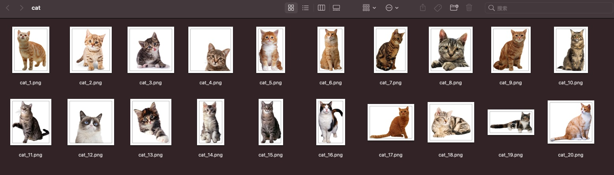
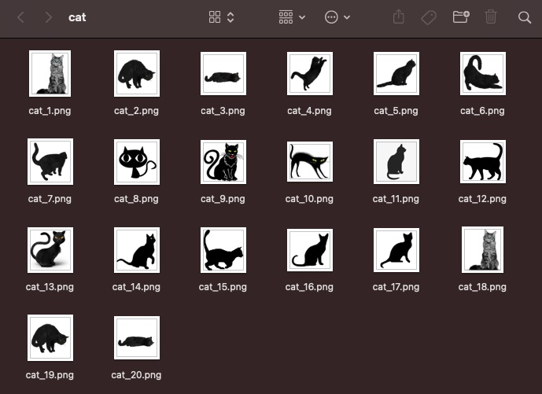

# bing_images

[](https://pypi.org/project/bing-images)
[](https://pypi.org/project/bing-images/)
[](https://github.com/bing-images-dev/bing-images/blob/master/LICENSE)

Python library to fetch image urls and download using **multithreading** from [Bing.com](https://bing.com/).

## Features

- [x] Support **file type** filters.
- [x] Support [Bing.com](https://bing.com/) **filterui** filters.
- [x] Download using **multithreading** and custom thread **pool size**.
- [x] Support **purely** obtaining the image urls.

## Requirements

### Chromedriver

- Install [Google Chrome Browser](https://www.google.com/chrome/).
- Download `chromedriver` from [here](https://chromedriver.chromium.org/downloads).
- Add `chromedriver` to PATH.

## Installation

```shell
pip install bing-images
```

## Usage

### Fetch Image Urls

fetch_image_urls.py

```py
from bing_images import bing

urls = bing.fetch_image_urls("cat", limit=10, file_type='png', filters='+filterui:aspect-square+filterui:color2-bw')
print("{} images.".format(len(urls)))
counter = 1
for url in urls:
    print("{}: {}".format(counter, url))
    counter += 1
```

Run

```
❯ python fetch_image_urls.py
10 images.
1: http://pngimg.com/uploads/cat/cat_PNG50521.png
2: http://pngimg.com/uploads/cat/cat_PNG1616.png
3: https://pngimg.com/uploads/cat/cat_PNG50532.png
4: https://pngimg.com/uploads/cat/cat_PNG1621.png
5: https://pngimg.com/uploads/cat/cat_PNG1618.png
6: http://pngimg.com/uploads/cat/cat_PNG1624.png
7: http://www.pngmart.com/files/5/Black-Cat-PNG-Transparent.png
8: http://www.myiconfinder.com/uploads/iconsets/256-256-a96249f4c8a9753fd904f8be023dc25c-cat.png
9: https://pngimg.com/uploads/cat/cat_PNG1619.png
10: http://pngimg.com/uploads/cat/cat_PNG50521.png
```

> **filters**: You can visit <https://cn.bing.com/images/search?q=cat> to operate filters through the UI, and then observe the link changes.

### Download using multithreading

download.py

```py
from bing_images import bing

bing.download_images("cat",
                      20,
                      output_dir="/Users/catchzeng/Desktop/cat",
                      pool_size=10,
                      file_type="png",
                      force_replace=True)
```

> - **output_dir**: the default output_dir is `os.path.join(os.getcwd(), "bing-images")`
> - **pool_size**: thread poll size

Run

```shell
❯ python download.py
Save path: /Users/catchzeng/Desktop/cat
Downloading images
#1 http://pngimg.com/uploads/cat/cat_PNG50509.png Downloaded
#2 https://pngimg.com/uploads/cat/cat_PNG50498.png Downloaded
#3 http://www.freepngimg.com/download/cat/22193-3-adorable-cat.png Downloaded
#4 http://pngimg.com/uploads/cat/cat_PNG106.png Downloaded
#5 https://pngimg.com/uploads/cat/cat_PNG50465.png Downloaded
#6 https://pngimg.com/uploads/cat/cat_PNG50417.png Downloaded
#7 https://pngimg.com/uploads/cat/cat_PNG50480.png Downloaded
#8 http://pngimg.com/uploads/cat/cat_PNG119.png Downloaded
#9 https://pngimg.com/uploads/cat/cat_PNG50438.png Downloaded
#10 http://pngimg.com/uploads/cat/cat_PNG100.png Downloaded
#11 https://pngimg.com/uploads/cat/cat_PNG50447.png Downloaded
#12 https://pngimg.com/uploads/cat/cat_PNG50440.png Downloaded
#13 https://pngimg.com/uploads/cat/cat_PNG50433.png Downloaded
#14 https://www.pngarts.com/files/1/Baby-Cat-PNG-Free-Download.png Downloaded
#15 https://cdn.pixabay.com/photo/2017/02/22/16/55/cat-2089916_960_720.png Downloaded
#16 https://pngimg.com/uploads/cat/cat_PNG50434.png Downloaded
#17 http://pngimg.com/uploads/cat/cat_PNG50529.png Downloaded
#18 http://pngimg.com/uploads/cat/cat_PNG113.png Downloaded
#19 https://purepng.com/public/uploads/large/purepng.com-catanimalscat-981524673949tj5ns.png Downloaded
#20 https://pngimg.com/uploads/cat/cat_PNG50435.png Downloaded
Renaming images
Finished renaming
Done
Elapsed time: 20.76s
```



### Download images with **filterui** filters

download-square-and-black-white.py

```py
from bing_images import bing

bing.download_images("cat",
                      20,
                      output_dir="/Users/catchzeng/Desktop/cat",
                      pool_size=20,
                      file_type="png",
                      filters='+filterui:aspect-square+filterui:color2-bw',
                      force_replace=True)
```


