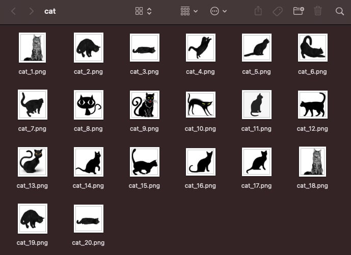

# bing_images

[](https://pypi.org/project/bing-images)
[](https://pypi.org/project/bing-images/)
[](https://github.com/bing-images-dev/bing-images/blob/master/LICENSE)

Python library to fetch image urls and download using **multithreading** from [Bing.com](https://bing.com/).

## Features

- [x] Support **file type** filters.
- [x] Support [Bing.com](https://bing.com/) **filterui** filters.
- [x] Download using **multithreading** and custom thread **pool size**.
- [x] Support **purely** obtaining the image urls.

## Requires

- requests>=2.24.0

## Installation

```shell
pip install bing-images
```

## Usage

### Fetch Image Urls

```py
from bing_images import bing

urls = bing.fetch_image_urls("cat", limit=100, file_type='png', filters='+filterui:aspect-square+filterui:color2-bw')
print("{} images.".format(len(urls)))
counter = 1
for url in urls:
    print("{}: {}".format(counter, url))
    counter += 1
```

> **filters**: You can visit <https://cn.bing.com/images/search?q=cat> to operate filters through the UI, and then observe the link changes.

### Download using multithreading

download.py

```py
from bing_images import bing

bing.download_images("cat",
                      20,
                      output_dir="/Users/catchzeng/Desktop/cat",
                      pool_size=10,
                      file_type="png",
                      force_replace=True)
```

> - **output_dir**: the default output_dir is `os.path.join(os.getcwd(), "bing-images")`
> - **pool_size**: thread poll size

Run

```shell
❯ python download.py
Save path: /Users/catchzeng/Desktop/cat
Downloading image #1 from http://pngimg.com/uploads/cat/cat_PNG100.png
Downloading image #2 from http://www.freepngimg.com/download/cat/22193-3-adorable-cat.png
Downloading image #3 from http://pngimg.com/uploads/cat/cat_PNG106.png
Downloading image #5 from https://pngimg.com/uploads/cat/cat_PNG50433.png
Downloading image #6 from https://pngimg.com/uploads/cat/cat_PNG50434.png
Downloading image #4 from http://pngimg.com/uploads/cat/cat_PNG50509.png
Downloading image #8 from http://pngimg.com/uploads/cat/cat_PNG50480.png
Downloading image #9 from https://pngimg.com/uploads/cat/cat_PNG50447.png
Downloading image #10 from http://pngimg.com/uploads/cat/cat_PNG50529.png
Downloading image #7 from http://pngimg.com/uploads/cat/cat_PNG119.png
Downloading image #11 from https://pngimg.com/uploads/cat/cat_PNG50438.png
Image #4 Downloaded
Downloading image #12 from http://pngimg.com/uploads/cat/cat_PNG50498.png
Image #3 Downloaded
Downloading image #13 from https://pngimg.com/uploads/cat/cat_PNG50465.png
Image #12 Downloaded
Downloading image #14 from https://pngimg.com/uploads/cat/cat_PNG50417.png
Image #2 Downloaded
Downloading image #15 from https://pngimg.com/uploads/cat/cat_PNG50440.png
Image #6 Downloaded
Downloading image #16 from http://pngimg.com/uploads/cat/cat_PNG113.png
Image #8 Downloaded
Downloading image #17 from http://pngimg.com/uploads/cat/cat_PNG50442.png
Image #1 Downloaded
Downloading image #18 from https://purepng.com/public/uploads/large/purepng.com-catanimalscat-981524673949tj5ns.png
Image #7 Downloaded
Downloading image #19 from https://pngimg.com/uploads/cat/cat_PNG50435.png
Image #9 Downloaded
Downloading image #20 from https://cdn.pixabay.com/photo/2017/02/22/16/55/cat-2089916_960_720.png
Image #15 Downloaded
Image #20 Downloaded
Image #14 Downloaded
Image #17 Downloaded
Image #16 Downloaded
Image #18 Downloaded
Image #11 Downloaded
Image #13 Downloaded
Image #19 Downloaded
Image #5 Downloaded
Image #10 Downloaded
Done
Elapsed Time: 29.91s
```


### Download images with **filterui** filters

download-square-and-black-white.py

```py
from bing_images import bing

bing.download_images("cat",
                      20,
                      output_dir="/Users/catchzeng/Desktop/cat",
                      pool_size=20,
                      file_type="png",
                      filters='+filterui:aspect-square+filterui:color2-bw',
                      force_replace=True)
```


